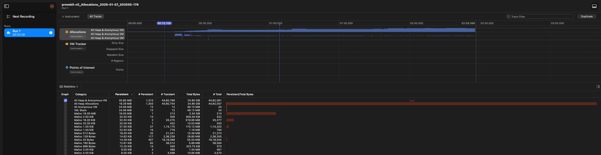
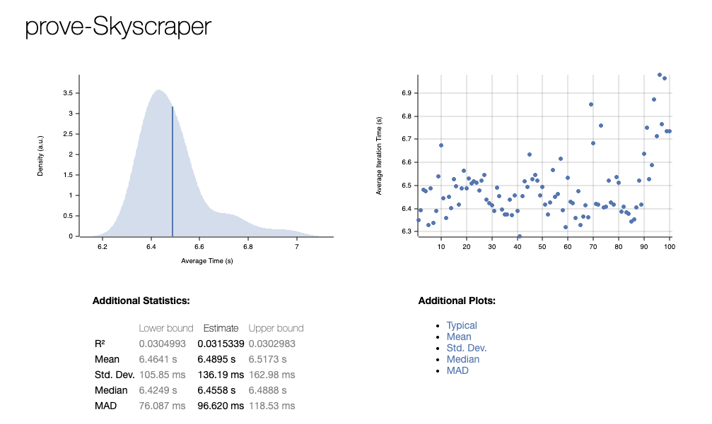
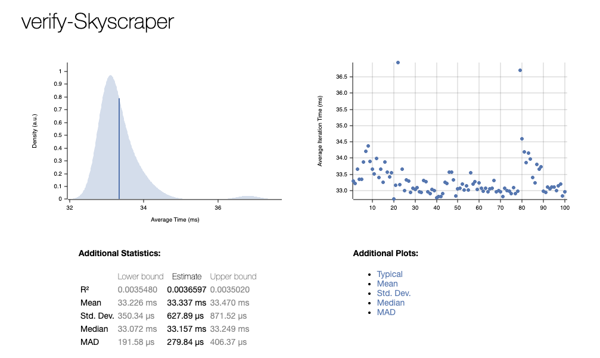
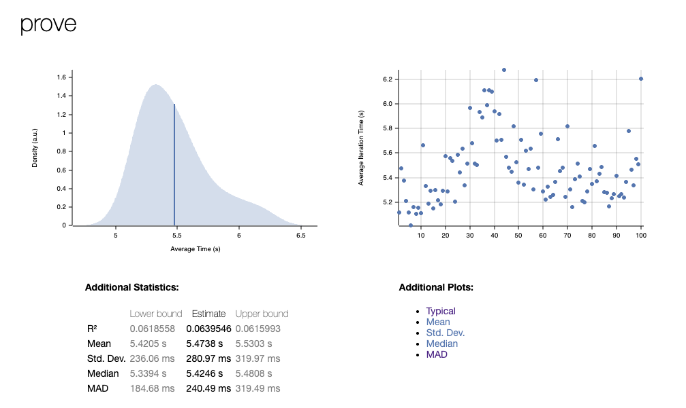
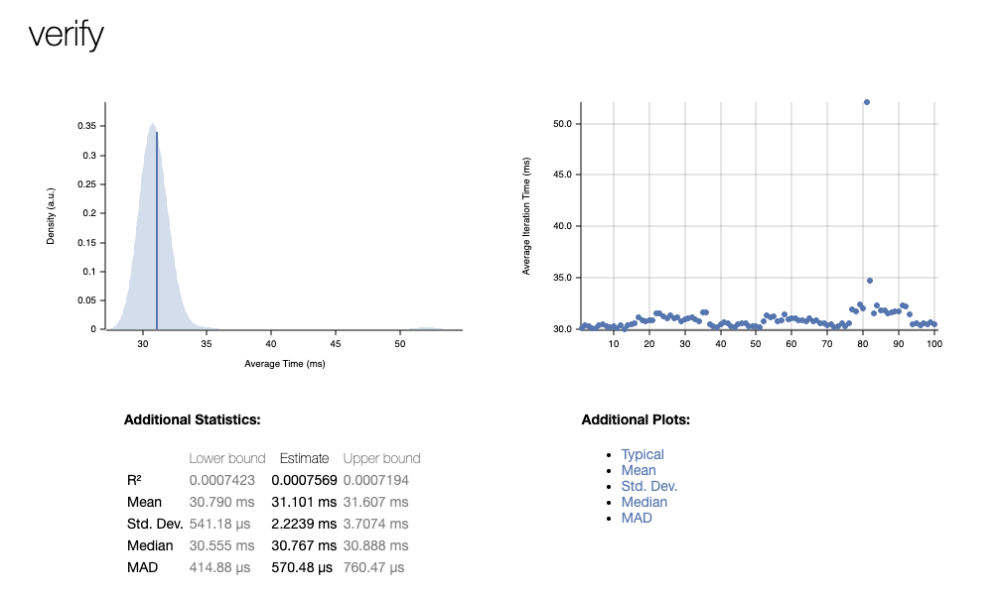
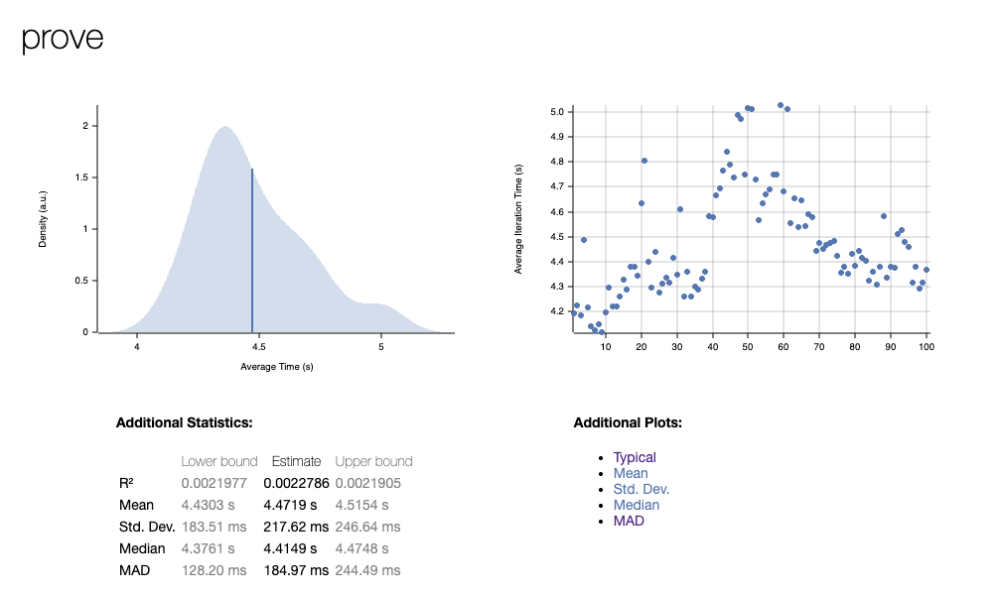
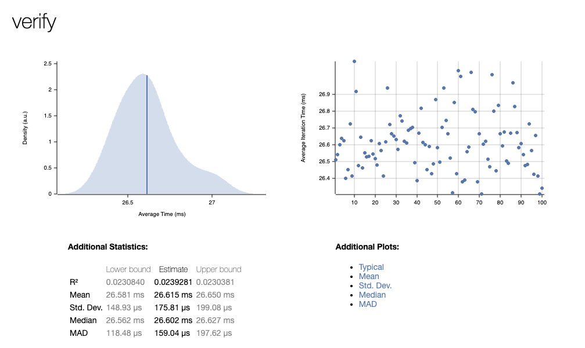
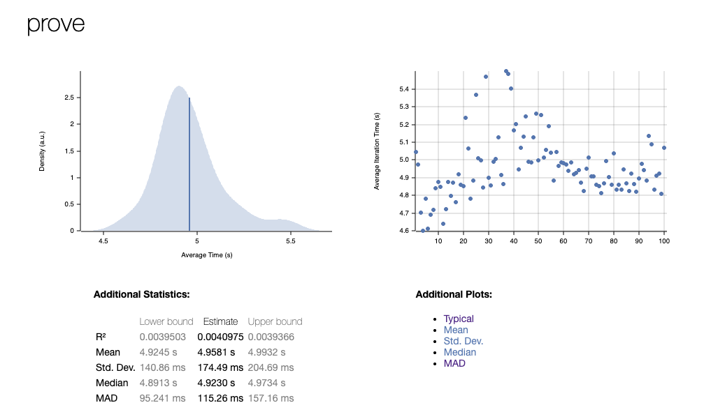
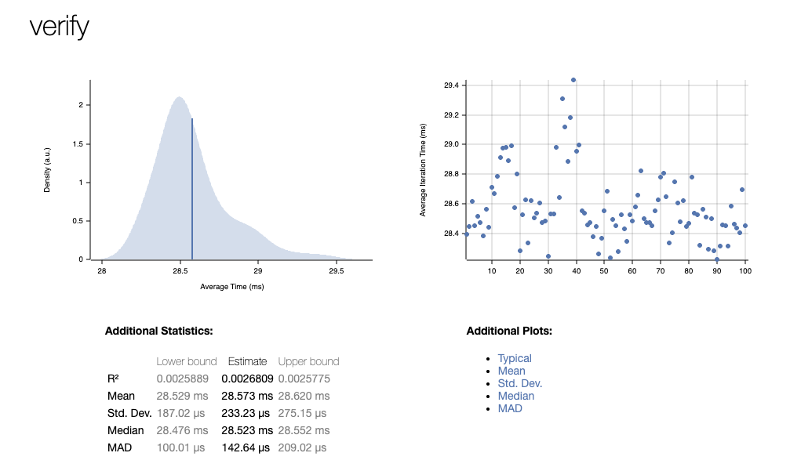

# Benchmarking

4 hash functions were benchmarked. Skyscraper is the default hash function. There are no protocol breaking changes between the hash functions. Each hash function is hidden behind a feature flag in order to compile the protocol with the desired hash function.

## Hash Functions

- Skyscraper (default)
- SHA2 (--features hash-sha2)
- Blake3 (--features hash-blake3)
- Keccak (--features hash-keccak)

## Benchmarking

- Proving time
- Verification time
- Memory usage

## To run benchmarks

```sh
# Compile circuit
cd noir-examples/noir-passport-examples/complete_age_check
nargo compile

# Prepare
cargo run --bin provekit-cli --release --features hash-<hash_function> prepare noir-examples/noir-passport-examples/complete_age_check/target/complete_age_check.json --pkp ./prover.pkp --pkv ./verifier.pkv

# Run benchmarks
cargo run --bin provekit-cli --release --features hash-<hash_function> benchmark ./prover.pkp ./verifier.pkv noir-examples/noir-passport-examples/complete_age_check/Prover.toml
```

This will generate a report in the `target/criterion` directory.

```sh
open $pwd/target/criterion/report/index.html
```

To get memory usage run :

```sh
cargo instruments --template Allocations --bin provekit-cli --release --features hash-<hash_function> prove ./prover.pkp noir-examples/noir-passport-examples/complete_age_check/Prover.toml -o ./proof.np
```

Example output:



## Results

| Hash Function | Proving Time (Mean) | Verification Time (Mean) | Prover Chart                          | Verifier Chart                         |
| ------------- | ------------------- | ------------------------ | ------------------------------------- | -------------------------------------- |
| Skyscraper    | 5.869s              | 33.804ms                 |  |  |
| SHA2          | 5.420s              | 30.790ms                 |              |              |
| Blake3        | 4.430s              | 26.615ms                 |          |          |
| Keccak        | 4.924s              | 28.573ms                 |          |          |
